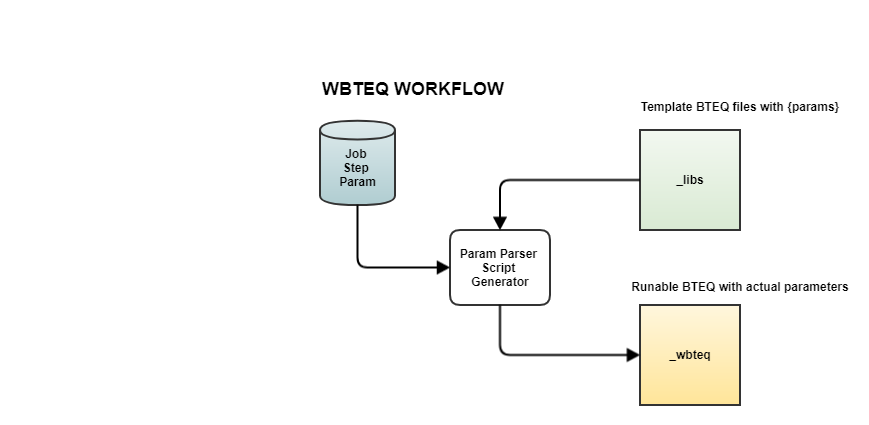

# Wrapper for Teradata BTEQ Command
----
[](LICENSE)


---

Welcome to the project **WBTEQ**, I suppose you are struggling with how to run BTEQ scripts on Windows platform, then you are on the right page.

The purpose of this project is to make life easier to run BTEQ scripts on Windows. To test/install/deploy **WBTEQ**, here are the basic requirement:

* You need a computer with Windows OS. Your account should have the permission to install `pip` packages, and the permission to create Environment Variables
* You need the Teradata Utility installed on that computer, try to run `bteq` command from console to test it
* You have the connection detail of a Teradata server, and you have the write permission to at least one schema
* Python 3.5+ is required, and `pyodbc` - https://github.com/mkleehammer/pyodbc is installed

## How to install

* The first task, create two new environment variables
`WBTEQ_DB_NAME` - the database name you have write permission  
`WBTEQ_DB_URL` - database URL
* Find the file `system_tables_ddl.sql` and execute the SQLs to create system tables and SPs on Teradata
* Run the test case by run `python test_wbteq.py` - check if any failed
* Install the package by `python setup.py install` (you may need the permission depends on where to be installed)


## Design and Workflow



TODO: A ER diagram is required

There are three tables in Teradata to store the information about WBTEQ jobs. The **WBTEQ** command will be scheduled to run every day, and it checkes the `wbteq_jobs` table to see if any jobs need to be run as of today. The rules are simple,
* Production mode - It checks the `is_enabled` and if the `day_of_month` or `day_of_week` matches current date
* Test mode - It only checks the `is_enabled = 'T'`, no matter other set up

Here is the table definition,  
### wbteq_jobs
- job_id `pk`
- freq ('M' - monthly,'W' - weekly, 'D' - everyday)
- day_of_month
- day_of_week
- hour24 (Not supported yet)
- job_name
- job_owner
- job_owner_email (single email addr or separated by ';')
- is_enabled ('Y','N')
- created_at
- updated_at

### wbteq_steps
- step_id `pk`
- job_id `fk`
- seq_num
- filename
- created_at
- updated_at

### wbteq_params
- param_id `pk`
- step_id `fk`
- param_type ('D','P','S')  Direct / Python (UDF) / SQL
- param_name
- param_value
- created_at
- updated_at

## UDFs
User Defined Function is a Python function to handle `param_type = 'D'` parameters. The format for `D` type is  
`func$p1$p2`

Implemented UDFs:

- `month_end` is one UDF, which accepts two arguments, `fmt` and `offset`
> fmt = 'str' --> yyyymmdd  
> fmt = 'date' -- > cast('dd/mm/yyyy' as date format 'dd/mm/yyyy')  
> fmt = 'month_key' -- > yyyymm  
> The `offset` could be -1 or 1 or any integer value to control which month to be returned

Example:  
`month_end$str$0` - will get the current month end date in `yyyymmdd` format

## Pre Installed Store Procedures
There are four pre installed SPs to create Jobs, Steps and Params. Here is the interface of calling these SPs.

```sql

CALL WBTEQ_C_JOB(
	'JOB ABC' 	    -- JOB_NAME
,	'D'			    -- FREQ
,	NULL		    -- DAY OF MONTH
,	NULL		    -- DAY OF WEEK
,	NULL		    -- HOUR
,	'Owner'	        -- OWNER
,	'email@addr'	-- EMAIL
,	Message
);

CALL WBTEQ_C_Step(
	5               -- Existing job id
,	10              -- Seq number
,	'filename.abc'  -- script file name
,	Message
);

CALL WBTEQ_C_Param(
	111             -- Existing step id
,	'P'             -- Parameter type, D / P / S
,	'param_name'    -- the value to be replaced
,	'param_value'   -- the actual value / formula / function
,	Message
);

CALL WBTEQ_D_Job(
	5               -- The job ID to be deleted, CASCADE mode
,	Message
);
```

## Usage
```
usage: wbteq [-h] [-l LIB] [-f FOLDER] [-d DAYS] [-t] [-e] [-v]
             username password

BTEQ Jobs management on Windows

positional arguments:
  username              The Teradata logon name for running BTEQ(s)
  password              The Teradata logon password for running BTEQ(s)

optional arguments:
  -h, --help            show this help message and exit
  -l LIB, --lib LIB     The library folder for WBTEQ (default _libs)
  -f FOLDER, --folder FOLDER
                        The working folder for WBTEQ (default _wbteq)
  -d DAYS, --days DAYS  The # of days to keep logs/scripts (default 7)
  -t, --test            The flag to run as TEST mode, default is False
  -e, --exec            The flag to execute BTEQ, only for production mode
  -v, --version         displays the current version of wbteq
```

This is a sample command to call the program with default
```
C:\>wbteq tduser tdpass
```

## License
MIT
